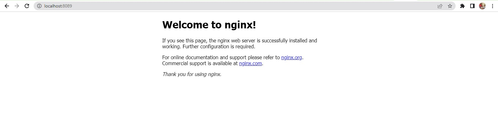

## **DEPLOYING APPLICATIONS INTO KUBERNETES CLUSTER** ###

In this project, I built upon the knowledge of Kubernetes architecture, and begin to deploy applications on a K8s cluster. Kubernetes has a lot of moving parts; it operates with several layers of abstraction between applications and host machines where it runs.

**Choosing the right Kubernetes cluster set up**

When it comes to using a Kubernetes cluster, there is a number of options available depending on the ultimate use of it. For example, if you just need a cluster for development or learning, you can use lightweight tools like Minikube, or k3s. These tools can run on your workstation without heavy system requirements. Obviously, there is limit to the amount of workload you can deploy there for testing purposes, but it works exactly like any other Kubernetes cluster.

On the other hand, if you need something more robust, suitable for a production workload and with more advanced capabilities such as horizontal scaling of the worker nodes, then you can consider building own Kubernetes cluster from scratch just as you did in Project 21.
Other options will be to leverage a Managed Service Kubernetes cluster from public cloud providers such as: AWS EKS, Microsoft AKS, or Google Cloud Platform GKE. There are so many more options out there. Regardless of whichever one you choose, the experience is usually very similar.

Most organisations choose Managed Service options for obvious reasons such as:

1. Less administrative overheads
1. Reduced cost of ownership
1. Improved Security
1. Seamless support
1. Periodical updates to a stable and well-tested version
1. Faster cluster spin up

However, there is usually strong reasons why organisations with very strict compliance and security concerns choose to build their own Kubernetes clusters. Most of the companies that go this route will mostly use on-premises data centres. When there is need to store data privately due to its sensitive nature, companies will rather not use a public cloud provider. Because, if they do, they have no idea of the physical location of the data centre in which their data is being persisted. Banks and Governments are typical examples of this.

Some setup options can combine both public and private cloud together. For example, the master nodes, etcd clusters, and some worker nodes that run stateful applications can be configured in private datacentres, while worker nodes that require heavy computations and stateless applications can run in public clouds. This kind of hybrid architecture is ideal to satisfy compliance, while also benefiting from other public cloud capabilities.

**Deploying the Tooling app using Kubernetes objects**
I wrote configuration files for Kubernetes objects (they are usually referred as manifests) in the form of files with yaml syntax and deploy them using kubectl console. But first, let us understand what a Kubernetes object is.
Kubernetes objects are persistent entities in the Kubernetes system. Kubernetes uses these entities to represent the state of your cluster. Specifically, they can describe:

- What containerized applications are running (and on which nodes)
- The resources available to those applications
- The policies around how those applications behave, such as restart policies, upgrades, and fault-tolerance

These objects are "record of intent" – once you create the object, the Kubernetes system will constantly work to ensure that the object exists. By creating an object, you are effectively telling the Kubernetes system what you want your cluster’s workload to look like; this is your cluster’s desired state.

To work with Kubernetes objects – whether to create, modify, or delete them – you will need to use the Kubernetes API. When you use the kubectl command-line interface, for example, the CLI makes the necessary Kubernetes API calls for you. It is also possible to use curl to directly interact with the Kubernetes API, or it can be as part of developing a program in different programming languages.

#### **COMMON KUBERNETES OBJECTS** ###

- Pod
- Namespace
- ResplicaSet (Manages Pods)
- DeploymentController (Manages Pods)
- StatefulSet
- DaemonSet
- Service
- ConfigMap
- Volume
- Job/Cronjob

The very first concept to understand is the difference between how Docker and Kubernetes run containers – with Docker, every docker run command will run an image (representing an application) as a container. The running container is a Docker’s smallest entity, it is the most basic deployable object. Kubernetes on the other hand operates with **pods** instead of containers, a pods encapsulates a container. Kubernetes uses pods as its smallest, and most basic deployable object with a unique feature that allows it to run multiple containers within a single Pod. It is not the most common pattern – to have more than one container in a Pod, but there are cases when this capability comes in handy.

In the world of docker, or docker compose, to run the Tooling app, you must deploy separate containers for the application and the database. But in the world of Kubernetes, you can run both: application and database containers in the same Pod. When multiple containers run within the same Pod, they can directly communicate with each other as if they were running on the same localhost. Although running both the application and database in the same Pod is NOT a recommended approach.

A Pod that contains one container is called single container pod and it is the most common Kubernetes use case. A Pod that contains multiple co-related containers is called multi-container pod. There are few patterns for multi-container Pods; one of them is the sidecar container pattern – it means that in the same Pod there is a main container and an auxiliary one that extends and enhances the functionality of the main one without changing it.

### Understanding the common YAML fields for every Kubernetes object ###
Every Kubernetes object includes object fields that govern the object’s configuration:

**kind:** Represents the type of kubernetes object created. It can be a Pod, DaemonSet, Deployments or Service.
**version:** Kubernetes api version used to create the resource, it can be v1, v1beta and v2. Some of the kubernetes features can be released under beta and available for general public usage.
**metadata:** provides information about the resource like name of the Pod, namespace under which the Pod will be running,
labels and annotations.
**spec:** consists of the core information about Pod. Here we will tell kubernetes what would be the expected state of resource, Like container image, number of replicas, environment variables and volumes.
**status:** consists of information about the running object, status of each container. Status field is supplied and updated by Kubernetes after creation. This is not something you will have to put in the YAML manifest.

#### Deploying a random Pod ####
Lets see what it looks like to have a Pod running in a k8s cluster. This section is just to illustrate and get you to familiarise with how the object’s fields work. Lets deploy a basic Nginx container to run inside a Pod.

**apiVersion** is v1
**kind** is Pod
**metatdata** has a name which is set to nginx-pod
The **spec** section has further information about the Pod. Where to find the image to run the container – (This defaults to Docker Hub), the port and protocol.

1. Create a **Pod** yaml manifest on your master node
~~~
apiVersion: v1
kind: Pod
metadata:
  name: nginx-pod
spec:
  containers:
  - image: nginx:latest
    name: nginx-pod
    ports:
    - containerPort: 80
      protocol: TCP
~~~
2. Apply the manifest with the help of kubectl
~~~
kubectl apply -f nginx-pod.yaml
~~~

3. Get an output of the pods running in the cluster
~~~
kubectl get pods
~~~
**Output:**
~~~
NAME        READY   STATUS    RESTARTS   AGE
nginx-pod   1/1     Running   0          102s
~~~

4. To see other fields introduced by kubernetes after you have deployed the resource, simply run below command, and examine the output. You will see other fields that kubernetes updates from time to time to represent the state of the resource within the cluster. -o simply means the output format.
~~~
kubectl get pod nginx-pod -o yaml
~~~
**Output:**
~~~
apiVersion: v1
kind: Pod
metadata:
  annotations:
    kubectl.kubernetes.io/last-applied-configuration: |
      {"apiVersion":"v1","kind":"Pod","metadata":{"annotations":{},"name":"nginx-pod","namespace":"default"},"spec":{"containers":[{"image":"nginx:latest","name":"nginx-pod","ports":[{"containerPort":80,"protocol":"TCP"}]}]}}
    kubernetes.io/psp: eks.privileged
  creationTimestamp: "2022-11-07T10:48:40Z"
  name: nginx-pod
  namespace: default
  resourceVersion: "3921"
  uid: 5e664a09-d7eb-42fc-a978-accb5184be3e
spec:
  containers:
  - image: nginx:latest
    imagePullPolicy: Always
    name: nginx-pod
    ports:
    - containerPort: 80
      protocol: TCP
    resources: {}
    terminationMessagePath: /dev/termination-log
    terminationMessagePolicy: File
    volumeMounts:
    - mountPath: /var/run/secrets/kubernetes.io/serviceaccount
      name: kube-api-access-hg9n4
      readOnly: true
  dnsPolicy: ClusterFirst
  enableServiceLinks: true
  nodeName: ip-10-0-1-138.ec2.internal
  preemptionPolicy: PreemptLowerPriority
  priority: 0
  restartPolicy: Always
  schedulerName: default-scheduler
  securityContext: {}
  serviceAccount: default
  serviceAccountName: default
  terminationGracePeriodSeconds: 30
  tolerations:
  - effect: NoExecute
    key: node.kubernetes.io/not-ready
    operator: Exists
    tolerationSeconds: 300
  - effect: NoExecute
    key: node.kubernetes.io/unreachable
    operator: Exists
    tolerationSeconds: 300
  volumes:
  - name: kube-api-access-hg9n4
    projected:
      defaultMode: 420
      sources:
      - serviceAccountToken:
          expirationSeconds: 3607
          path: token
      - configMap:
          items:
          - key: ca.crt
            path: ca.crt
          name: kube-root-ca.crt
      - downwardAPI:
          items:
          - fieldRef:
              apiVersion: v1
              fieldPath: metadata.namespace
            path: namespace
status:
  conditions:
  - lastProbeTime: null
    lastTransitionTime: "2022-11-07T10:48:40Z"
    status: "True"
    type: Initialized
  - lastProbeTime: null
    lastTransitionTime: "2022-11-07T10:48:46Z"
    status: "True"
    type: Ready
  - lastProbeTime: null
    lastTransitionTime: "2022-11-07T10:48:46Z"
    status: "True"
    type: ContainersReady
  - lastProbeTime: null
    lastTransitionTime: "2022-11-07T10:48:40Z"
    status: "True"
    type: PodScheduled
  containerStatuses:
  - containerID: docker://11c9ba6930b63f908809cdd6195c325a51095280e0c34fd874089b1605fd1e2c
    image: nginx:latest
    imageID: docker-pullable://nginx@sha256:943c25b4b66b332184d5ba6bb18234273551593016c0e0ae906bab111548239f
    lastState: {}
    name: nginx-pod
    ready: true
    restartCount: 0
    started: true
    state:
      running:
        startedAt: "2022-11-07T10:48:45Z"
  hostIP: 10.0.1.138
  phase: Running
  podIP: 10.0.1.228
  podIPs:
  - ip: 10.0.1.228
  qosClass: BestEffort
  startTime: "2022-11-07T10:48:40Z"
  ~~~
or
~~~
kubectl describe pod nginx-pod
~~~
**Output:**
~~~
Name:             nginx-pod
Namespace:        default
Priority:         0
Service Account:  default
Node:             ip-10-0-1-138.ec2.internal/10.0.1.138
Start Time:       Mon, 07 Nov 2022 10:48:40 +0000
Labels:           <none>
Annotations:      kubernetes.io/psp: eks.privileged
Status:           Running
IP:               10.0.1.228
IPs:
  IP:  10.0.1.228
Containers:
  nginx-pod:
    Container ID:   docker://11c9ba6930b63f908809cdd6195c325a51095280e0c34fd874089b1605fd1e2c
    Image:          nginx:latest
    Image ID:       docker-pullable://nginx@sha256:943c25b4b66b332184d5ba6bb18234273551593016c0e0ae906bab111548239f
    Port:           80/TCP
    Host Port:      0/TCP
    State:          Running
      Started:      Mon, 07 Nov 2022 10:48:45 +0000
    Ready:          True
    Restart Count:  0
    Environment:    <none>
    Mounts:
      /var/run/secrets/kubernetes.io/serviceaccount from kube-api-access-hg9n4 (ro)
Conditions:
  Type              Status
  Initialized       True 
  Ready             True 
  ContainersReady   True 
  PodScheduled      True 
Volumes:
  kube-api-access-hg9n4:
    Type:                    Projected (a volume that contains injected data from multiple sources)
    TokenExpirationSeconds:  3607
    ConfigMapName:           kube-root-ca.crt
    ConfigMapOptional:       <nil>
    DownwardAPI:             true
QoS Class:                   BestEffort
Node-Selectors:              <none>
Tolerations:                 node.kubernetes.io/not-ready:NoExecute op=Exists for 300s
                             node.kubernetes.io/unreachable:NoExecute op=Exists for 300s
Events:
  Type    Reason     Age    From               Message
  ----    ------     ----   ----               -------
  Normal  Scheduled  4m41s  default-scheduler  Successfully assigned default/nginx-pod to ip-10-0-1-138.ec2.internal
  Normal  Pulling    4m39s  kubelet            Pulling image "nginx:latest"
  Normal  Pulled     4m36s  kubelet            Successfully pulled image "nginx:latest" in 3.051842698s
  Normal  Created    4m36s  kubelet            Created container nginx-pod
  Normal  Started    4m36s  kubelet            Started container nginx-pod
  ~~~
### **ACCESSING THE APP FROM THE BROWSER** ###
The ultimate goal of any solution is to access it either through a web portal or some application (e.g., mobile app). We have a Pod with Nginx container, so we need to access it from the browser. But all you have is a running Pod that has its own IP address which cannot be accessed through the browser. To achieve this, we need another Kubernetes object called Service to accept our request and pass it on to the Pod.

A service is an object that accepts requests on behalf of the Pods and forwards it to the Pod’s IP address. If you run the command below, you will be able to see the Pod’s IP address. But there is no way to reach it directly from the outside world.

~~~
kubectl get pod nginx-pod  -o wide 
~~~
**Ouput**
~~~
NAME        READY   STATUS    RESTARTS   AGE     IP           NODE                         NOMINATED NODE   READINESS GATES
nginx-pod   1/1     Running   0          5m46s   10.0.1.228   ip-10-0-1-138.ec2.internal   <none>           <none>
~~~

Let us try to access the Pod through its IP address from within the K8s cluster. To do this,

1. We need an image that already has curl software installed.
~~~
dareyregistry/curl
~~~

2. Run kubectl to connect inside the container
~~~
kubectl run curl --image=dareyregistry/curl -i --tty
~~~

3. Run curl and point to the IP address of the Nginx Pod (Use the IP address of your own Pod)
~~~
curl -v 10.0.1.228:80
~~~

**Output**
~~~
/ # curl -v 10.0.1.228:80
> GET / HTTP/1.1
> User-Agent: curl/7.35.0
> Host: 10.0.1.228
> Accept: */*
> 
< HTTP/1.1 200 OK
< Server: nginx/1.23.2
< Date: Mon, 07 Nov 2022 10:59:26 GMT
< Content-Type: text/html
< Content-Length: 615
< Last-Modified: Wed, 19 Oct 2022 07:56:21 GMT
< Connection: keep-alive
< ETag: "634fada5-267"
< Accept-Ranges: bytes
< 
<!DOCTYPE html>
<html>
<head>
<title>Welcome to nginx!</title>

</head>
<body>
<h1>Welcome to nginx!</h1>

If you see this page, the nginx web server is successfully installed and
working. Further configuration is required.

For online documentation and support please refer to
<a href="http://nginx.org/">nginx.org</a>. 
Commercial support is available at
<a href="http://nginx.com/">nginx.com</a>.

<em>Thank you for using nginx.</em>

</body>
</html>
~~~

If the use case for your solution is required for internal use ONLY, without public Internet requirement. Then, this should be OK. But in most cases, it is NOT!

Assuming that your requirement is to access the Nginx Pod internally, using the Pod’s IP address directly as above is not a reliable choice because Pods are ephemeral. They are not designed to run forever. When they die and another Pod is brought back up, the IP address will change and any application that is using the previous IP address directly will break.

To solve this problem, kubernetes uses Service – An object that abstracts the underlining IP addresses of Pods. A service can serve as a load balancer, and a reverse proxy which basically takes the request using a human readable DNS name, resolves to a Pod IP that is running and forwards the request to it. This way, you do not need to use an IP address. Rather, you can simply refer to the service name directly.

Let us create a service to access the Nginx Pod:

1. Create a Service yaml manifest file:
~~~
sudo cat <<EOF | sudo tee ./nginx-service.yaml
apiVersion: v1
kind: Service
metadata:
  name: nginx-service
spec:
  selector:
    app: nginx-pod 
  ports:
    - protocol: TCP
      port: 80
      targetPort: 80
EOF
~~~

2. Create a nginx-service resource by applying your manifest
~~~
kubectl apply -f nginx-service.yaml
~~~
**Output**
~~~
service/nginx-service created
~~~

3. Check the created service
~~~
kubectl get service
~~~

output:
~~~
NAME            TYPE        CLUSTER-IP       EXTERNAL-IP   PORT(S)   AGE
kubernetes      ClusterIP   172.20.0.1       <none>        443/TCP   39m
nginx-service   ClusterIP   172.20.101.152   <none>        80/TCP    16s
~~~

**Observation:**

The **TYPE** column in the output shows that there are different service types.

- ClusterIP
- NodePort
- LoadBalancer &
- Headless Service

**ClusterIP** is the default service type when no *type* is specified in the manifest file

Now that we have a service created, how can we access the app? Since there is no public IP address, we can leverage kubectl's port-forward functionality.
~~~
kubectl  port-forward svc/nginx-service 8089:80
~~~
8089 is an arbitrary port number on your laptop or client PC, and we want to tunnel traffic through it to the port number of the nginx-service 80.

Unfortunately, this will not work quite yet. Because there is no way the service will be able to select the actual Pod it is meant to route traffic to. If there are hundreds of Pods running, there must be a way to ensure that the service only forwards requests to the specific Pod it is intended for.

To make this work, you must reconfigure the Pod manifest and introduce labels to match the selectors key in the field section of the service manifest.

1. Update the Pod manifest with the below and apply the manifest:
~~~
apiVersion: v1
kind: Pod
metadata:
  name: nginx-pod
  labels:
    app: nginx-pod  
spec:
  containers:
  - image: nginx:latest
    name: nginx-pod
    ports:
    - containerPort: 80
      protocol: TCP
~~~

under the metadata section, we have now introduced **labels** with a key field called **app** and its value nginx-pod. This matches exactly the selector key in the service manifest.

The key/value pairs can be anything you specify. These are not Kubernetes specific keywords. As long as it matches the selector, the service object will be able to route traffic to the Pod.

Apply the manifest with:
~~~
kubectl apply -f nginx-pod.yaml
~~~
2. Run kubectl port-forward command again
~~~
kubectl  port-forward svc/nginx-service 8089:80
~~~

**output:**
~~~
Forwarding from 127.0.0.1:8089 -> 80
Forwarding from [::1]:8089 -> 80
~~~
Then go to your web browser and enter localhost:8089 – You should now be able to see the nginx page in the browser.
If your workstation is a remote machine and you are using Visual Studio code, you may have to forward the port 8089 on the VSC too for the end-point to display on your pc.

### **CREATE A REPLICA SET** ###
Let us create a rs.yaml manifest for a ReplicaSet object:
~~~
#Part 1
apiVersion: apps/v1
kind: ReplicaSet
metadata:
  name: nginx-rs
spec:
  replicas: 3
  selector:
    matchLabels:
      app: nginx-pod
#Part 2
  template:
    metadata:
      name: nginx-pod
      labels:
         app: nginx-pod
    spec:
      containers:
      - image: nginx:latest
        name: nginx-pod
        ports:
        - containerPort: 80
          protocol: TCP
~~~
Apply the manifest file with:
~~~
kubectl apply -f rs.yaml
~~~

The manifest file of ReplicaSet consist of the following fields:

- **apiVersion:** This field specifies the version of kubernetes Api to which the object belongs. ReplicaSet belongs to apps/v1 apiVersion.
- **kind:** This field specify the type of object for which the manifest belongs to. Here, it is ReplicaSet.
- **metadata:** This field includes the metadata for the object. It mainly includes two fields: name and labels of the ReplicaSet.
- **spec:** This field specifies the label selector to be used to select the Pods, number of replicas of the Pod to be run and the container or list of containers which the Pod will run. In the above example, we are running 3 replicas of nginx container.

Let us check what Pods have been created:
~~~
kubectl get pods
~~~
**Output:**
~~~
NAME             READY   STATUS    RESTARTS      AGE
nginx-pod        1/1     Running   0             57m
nginx-rs-rp7lc   1/1     Running   0             3m8s
nginx-rs-wdsqq   1/1     Running   0             3m8s
~~~
Here we see three ngix-pods with some random suffixes (e.g., -rp7lc) – it means, that these Pods were created and named automatically by some other object (higher level of abstraction) such as ReplicaSet.

Try to delete one of the Pods:
~~~
kubectl delete po nginx-pod
~~~
**Output:**
~~~
pod "nginx-pod" deleted
~~~
~~~
kubectl get pods
~~~
Output:
~~~
NAME             READY   STATUS    RESTARTS      AGE
nginx-rs-7n94g   1/1     Running   0             7s
nginx-rs-rp7lc   1/1     Running   0             8m4s
nginx-rs-wdsqq   1/1     Running   0             8m4s
~~~

Explore the ReplicaSet created:
~~~
kubectl get rs -o wide
~~~

**Output:**
~~~
NAME       DESIRED   CURRENT   READY   AGE   CONTAINERS   IMAGES         SELECTOR
nginx-rs   3         3         3       14m   nginx-pod    nginx:latest   app=nginx-pod
~~~
Notice, that ReplicaSet understands which Pods to create by using SELECTOR key-value pair.

**Get detailed information of a ReplicaSet**
To display detailed information about any Kubernetes object, you can use 2 differen commands:

- kubectl **describe** %object_type% %object_name% (e.g. kubectl describe rs nginx-rs)
**Output:**
~~~
Name:         nginx-rs
Namespace:    default
Selector:     app=nginx-pod
Labels:       <none>
Annotations:  <none>
Replicas:     3 current / 3 desired
Pods Status:  3 Running / 0 Waiting / 0 Succeeded / 0 Failed
Pod Template:
  Labels:  app=nginx-pod
  Containers:
   nginx-pod:
    Image:        nginx:latest
    Port:         80/TCP
    Host Port:    0/TCP
    Environment:  <none>
    Mounts:       <none>
  Volumes:        <none>
Events:
  Type    Reason            Age    From                   Message
  ----    ------            ----   ----                   -------
  Normal  SuccessfulCreate  16m    replicaset-controller  Created pod: nginx-rs-wdsqq
  Normal  SuccessfulCreate  16m    replicaset-controller  Created pod: nginx-rs-rp7lc
  Normal  SuccessfulCreate  8m26s  replicaset-controller  Created pod: nginx-rs-7n94g
  ~~~
- kubectl **get** %object_type% %object_name% -o yaml (e.g. kubectl describe rs nginx-rs -o yaml)
**Output**
~~~
apiVersion: apps/v1
kind: ReplicaSet
metadata:
  annotations:
    kubectl.kubernetes.io/last-applied-configuration: |
      {"apiVersion":"apps/v1","kind":"ReplicaSet","metadata":{"annotations":{},"name":"nginx-rs","namespace":"default"},"spec":{"replicas":3,"selector":{"matchLabels":{"app":"nginx-pod"}},"template":{"metadata":{"labels":{"app":"nginx-pod"},"name":"nginx-pod"},"spec":{"containers":[{"image":"nginx:latest","name":"nginx-pod","ports":[{"containerPort":80,"protocol":"TCP"}]}]}}}}
  creationTimestamp: "2022-11-07T11:43:31Z"
  generation: 1
  name: nginx-rs
  namespace: default
  resourceVersion: "12246"
  uid: f2af3264-e15c-413e-ab40-702952726435
spec:
  replicas: 3
  selector:
    matchLabels:
      app: nginx-pod
  template:
    metadata:
      creationTimestamp: null
      labels:
        app: nginx-pod
      name: nginx-pod
    spec:
      containers:
      - image: nginx:latest
        imagePullPolicy: Always
        name: nginx-pod
        ports:
        - containerPort: 80
          protocol: TCP
        resources: {}
        terminationMessagePath: /dev/termination-log
        terminationMessagePolicy: File
      dnsPolicy: ClusterFirst
      restartPolicy: Always
      schedulerName: default-scheduler
      securityContext: {}
      terminationGracePeriodSeconds: 30
status:
  availableReplicas: 3
  fullyLabeledReplicas: 3
  observedGeneration: 1
  readyReplicas: 3
  replicas: 3
~~~
~~~
kubectl get rs nginx-rs -o json
~~~
**Output:**
~~~
{
    "apiVersion": "apps/v1",
    "kind": "ReplicaSet",
    "metadata": {
        "annotations": {
            "kubectl.kubernetes.io/last-applied-configuration": "{\"apiVersion\":\"apps/v1\",\"kind\":\"ReplicaSet\",\"metadata\":{\"annotations\":{},\"name\":\"nginx-rs\",\"namespace\":\"default\"},\"spec\":{\"replicas\":3,\"selector\":{\"matchLabels\":{\"app\":\"nginx-pod\"}},\"template\":{\"metadata\":{\"labels\":{\"app\":\"nginx-pod\"},\"name\":\"nginx-pod\"},\"spec\":{\"containers\":[{\"image\":\"nginx:latest\",\"name\":\"nginx-pod\",\"ports\":[{\"containerPort\":80,\"protocol\":\"TCP\"}]}]}}}}\n"
        },
        "creationTimestamp": "2022-11-07T11:43:31Z",
        "generation": 1,
        "name": "nginx-rs",
        "namespace": "default",
        "resourceVersion": "12246",
        "uid": "f2af3264-e15c-413e-ab40-702952726435"
    },
    "spec": {
        "replicas": 3,
        "selector": {
            "matchLabels": {
                "app": "nginx-pod"
            }
        },
        "template": {
            "metadata": {
                "creationTimestamp": null,
                "labels": {
                    "app": "nginx-pod"
                },
                "name": "nginx-pod"
            },
            "spec": {
                "containers": [
                    {
                        "image": "nginx:latest",
                        "imagePullPolicy": "Always",
                        "name": "nginx-pod",
                        "ports": [
                            {
                                "containerPort": 80,
                                "protocol": "TCP"
                            }
                        ],
                        "resources": {},
                        "terminationMessagePath": "/dev/termination-log",
                        "terminationMessagePolicy": "File"
                    }
                ],
                "dnsPolicy": "ClusterFirst",
                "restartPolicy": "Always",
                "schedulerName": "default-scheduler",
                "securityContext": {},
                "terminationGracePeriodSeconds": 30
            }
        }
    },
    "status": {
        "availableReplicas": 3,
        "fullyLabeledReplicas": 3,
        "observedGeneration": 1,
        "readyReplicas": 3,
        "replicas": 3
    }
}
~~~
Try both commands in action and see the difference. Also try get with -o json instead of -o yaml and decide for yourself which output option is more readable for you.

**Scale ReplicaSet up and down:**
In general, there are 2 approaches of Kubernetes Object Management: imperative and declarative.

Let us see how we can use both to scale our Replicaset up and down:

**Imperative:**

We can easily scale our ReplicaSet up by specifying the desired number of replicas in an imperative command, like this:
~~~
kubectl scale --replicas=5 replicaset/nginx-rs
~~~

Check the pods:
~~~
kubectl get pods
~~~
**Output:**
~~~
NAME             READY   STATUS    RESTARTS      AGE
nginx-rs-7n94g   1/1     Running   0             24m
nginx-rs-8n8mg   1/1     Running   0             2m23s
nginx-rs-hmghv   1/1     Running   0             2m23s
nginx-rs-rp7lc   1/1     Running   0             32m
nginx-rs-wdsqq   1/1     Running   0             32m
~~~
Scaling down will work similarly
~~~
kubectl scale --replicas=3 replicaset/nginx-rs
~~~
kubectl get pod output:
~~~
NAME             READY   STATUS    RESTARTS      AGE
nginx-rs-7n94g   1/1     Running   0             32m
nginx-rs-rp7lc   1/1     Running   0             40m
nginx-rs-wdsqq   1/1     Running   0             40m
~~~

**Declarative:**

Declarative way would be to open our rs.yaml manifest, change desired number of replicas in respective section
~~~
spec:
  replicas: 3
~~~
and applying the updated manifest:
~~~
kubectl apply -f rs.yaml
~~~
There is another method – **‘ad-hoc’**, it is definitely not the best practice and we do not recommend using it, but you can edit an existing ReplicaSet with following command:
~~~
kubectl edit -f rs.yaml
~~~

**Advanced label matching**

As Kubernetes mature as a technology, so does its features and improvements to k8s objects. ReplicationControllers do not meet certain complex business requirements when it comes to using selectors. Imagine if you need to select Pods with multiple lables that represents things like:

Application tier: such as Frontend, or Backend
Environment: such as Dev, SIT, QA, Preprod, or Prod
So far, we used a simple selector that just matches a key-value pair and check only ‘equality’:
~~~
  selector:
    app: nginx-pod
~~~
But in some cases, we want ReplicaSet to manage our existing containers that match certain criteria, we can use the same simple label matching or we can use some more complex conditions, such as:

 - in
 - not in
 - not equal
 - etc...
Let us look at the following manifest file:
~~~
apiVersion: apps/v1
kind: ReplicaSet
metadata: 
  name: nginx-rs
spec:
  replicas: 3
  selector:
    matchLabels:
      env: prod
    matchExpressions:
    - { key: tier, operator: In, values: [frontend] }
  template:
    metadata:
      name: nginx
      labels: 
        env: prod
        tier: frontend
    spec:
      containers:
      - name: nginx-container
        image: nginx:latest
        ports:
        - containerPort: 80
          protocol: TCP
~~~
In the above spec file, under the selector, **matchLabels** and **matchExpression** are used to specify the key-value pair. The matchLabel works exactly the same way as the equality-based selector, and the matchExpression is used to specify the set based selectors. This feature is the main differentiator between *ReplicaSet* and previously mentioned obsolete *ReplicationController*.

Get the replication set:
~~~
kubectl get rs nginx-rs -o wide
~~~

**Output:*
~~~
NAME        DESIRED   CURRENT   READY   AGE   CONTAINERS        IMAGES         SELECTOR
nginx1-rs   3         3         3       69s   nginx-container   nginx:latest   env=prod,tier in (frontend)
~~~

### **USING AWS LOAD BALANCER TO ACCESS YOUR SERVICE IN KUBERNETES.** ###
### **USING DEPLOYMENT CONTROLLERS** ###

A Deployment is another layer above ReplicaSets and Pods, newer and more advanced level concept than ReplicaSets. It manages the deployment of ReplicaSets and allows for easy updating of a ReplicaSet as well as the ability to roll back to a previous version of deployment. It is declarative and can be used for rolling updates of micro-services, ensuring there is no downtime.

Officially, it is highly recommended to use Deplyments to manage replica sets rather than using replica sets directly.

Let us see Deployment in action.

1. Delete the ReplicaSet
~~~
kubectl delete rs nginx-rs
~~~
2. Understand the layout of the deployment.yaml manifest below. Lets go through the 3 separated sections:
~~~
# Section 1 - This is the part that defines the deployment
apiVersion: apps/v1
kind: Deployment
metadata:
  name: nginx-deployment
  labels:
    tier: frontend

# Section 2 - This is the Replica set layer controlled by the deployment
spec:
  replicas: 3
  selector:
    matchLabels:
      tier: frontend

# Section 3 - This is the Pod section controlled by the deployment and selected by the replica set in section 2.
  template:
    metadata:
      labels:
        tier: frontend
    spec:
      containers:
      - name: nginx
        image: nginx:latest
        ports:
        - containerPort: 80
~~~

3. Putting them altogether
~~~
apiVersion: apps/v1
kind: Deployment
metadata:
  name: nginx-deployment
  labels:
    tier: frontend
spec:
  replicas: 3
  selector:
    matchLabels:
      tier: frontend
  template:
    metadata:
      labels:
        tier: frontend
    spec:
      containers:
      - name: nginx
        image: nginx:latest
        ports:
        - containerPort: 80
~~~

Apply the manifest:
~~~
kubectl apply -f deployment.yaml
~~~
        

1. Get the Deployment
~~~
kubectl get deployment -o wide
~~~
**Output:*
~~~
NAME               READY   UP-TO-DATE   AVAILABLE   AGE   CONTAINERS   IMAGES         SELECTOR
nginx-deployment   3/3     3            3           91s   nginx        nginx:latest   tier=frontend
~~~
2. Get the ReplicaSet
~~~
kubectl get replicaset -o wide
~~~
**Output:*
~~~
NAME                          DESIRED   CURRENT   READY   AGE     CONTAINERS   IMAGES         SELECTOR
nginx-deployment-55c7d849bc   3         3         3       2m46s   nginx        nginx:latest   pod-template-hash=55c7d849bc,tier=frontend
~~~
3. Get the Pods
~~~
kubectl get pods
~~~
**Output:*
~~~
NAME                                READY   STATUS    RESTARTS       AGE
nginx-deployment-55c7d849bc-7hltl   1/1     Running   0              3m28s
nginx-deployment-55c7d849bc-h2qb5   1/1     Running   0              3m28s
nginx-deployment-55c7d849bc-v7rnh   1/1     Running   0              3m28s
~~~
4. Scale the replicas in the Deployment to 15 Pods
~~~
kubectl scale --replicas=15 deployment/nginx-deployment
~~~
*kubectl get pods* command output:
~~~
NAME                                READY   STATUS    RESTARTS       AGE
nginx-deployment-55c7d849bc-46rzs   1/1     Running   0              85s
nginx-deployment-55c7d849bc-5dhf7   1/1     Running   0              85s
nginx-deployment-55c7d849bc-5ffwv   1/1     Running   0              85s
nginx-deployment-55c7d849bc-7hltl   1/1     Running   0              6m40s
nginx-deployment-55c7d849bc-995j6   0/1     Pending   0              85s
nginx-deployment-55c7d849bc-h2qb5   1/1     Running   0              6m40s
nginx-deployment-55c7d849bc-ll4pv   0/1     Pending   0              85s
nginx-deployment-55c7d849bc-pb294   1/1     Running   0              86s
nginx-deployment-55c7d849bc-qg2sk   1/1     Running   0              85s
nginx-deployment-55c7d849bc-qlfcd   1/1     Running   0              86s
nginx-deployment-55c7d849bc-r6f98   1/1     Running   0              86s
nginx-deployment-55c7d849bc-rz5lz   1/1     Running   0              85s
nginx-deployment-55c7d849bc-v5pd6   0/1     Pending   0              85s
nginx-deployment-55c7d849bc-v7rnh   1/1     Running   0              6m40s
nginx-deployment-55c7d849bc-z257c   1/1     Running   0              85s
~~~
5. Exec into one of the Pod’s container to run Linux commands
~~~
kubectl exec -it nginx-deployment-55c7d849bc-z257c bash
~~~
List the files and folders in the Nginx directory
~~~
ls -ltr /etc/nginx/
~~~
**Output:**
~~~
root@nginx-deployment-55c7d849bc-z257c:/# ls -ltr /etc/nginx
total 24
-rw-r--r-- 1 root root  664 Oct 19 07:56 uwsgi_params
-rw-r--r-- 1 root root  636 Oct 19 07:56 scgi_params
-rw-r--r-- 1 root root 5349 Oct 19 07:56 mime.types
-rw-r--r-- 1 root root 1007 Oct 19 07:56 fastcgi_params
-rw-r--r-- 1 root root  648 Oct 19 09:32 nginx.conf
lrwxrwxrwx 1 root root   22 Oct 19 09:32 modules -> /usr/lib/nginx/modules
drwxr-xr-x 1 root root   26 Nov  7 13:05 conf.d
~~~
Check the content of the default Nginx configuration file
~~~
cat  /etc/nginx/conf.d/default.conf
~~~
**Output:**
~~~
root@nginx-deployment-55c7d849bc-z257c:/# cat  /etc/nginx/conf.d/default.conf
server {
    listen       80;
    listen  [::]:80;
    server_name  localhost;

    #access_log  /var/log/nginx/host.access.log  main;

    location / {
        root   /usr/share/nginx/html;
        index  index.html index.htm;
    }

    #error_page  404              /404.html;

    # redirect server error pages to the static page /50x.html
    #
    error_page   500 502 503 504  /50x.html;
    location = /50x.html {
        root   /usr/share/nginx/html;
    }

    # proxy the PHP scripts to Apache listening on 127.0.0.1:80
    #
    #location ~ \.php$ {
    #    proxy_pass   http://127.0.0.1;
    #}

    # pass the PHP scripts to FastCGI server listening on 127.0.0.1:9000
    #
    #location ~ \.php$ {
    #    root           html;
    #    fastcgi_pass   127.0.0.1:9000;
    #    fastcgi_index  index.php;
    #    fastcgi_param  SCRIPT_FILENAME  /scripts$fastcgi_script_name;
    #    include        fastcgi_params;
    #}

    # deny access to .htaccess files, if Apache's document root
    # concurs with nginx's one
    #
    #location ~ /\.ht {
    #    deny  all;
    #}
}
~~~

### PERSISTING DATA FOR PODS ###

Deployments are stateless by design. Hence, any data stored inside the Pod’s container does not persist when the Pod dies.

If you were to update the content of the index.html file inside the container, and the Pod dies, that content will not be lost since a new Pod will replace the dead one.

Let us try that:

1. Scale down the Pods to one (1) replica
~~~
kubectl scale --replicas=1 deployment nginx-deployment
~~~
Check with
~~~
kubectl get pods
~~~
Output:
~~~
NAME                                READY   STATUS    RESTARTS       AGE
nginx-deployment-55c7d849bc-46rzs   1/1     Running   0              30m
~~~
2. Exec into the running container (figure out the command yourself)

3. Install vim so that you can edit the file
~~~
apt-get update
apt-get install vim
~~~

4. Update the content of the file and add the code below /usr/share/nginx/html/index.html
~~~
<!DOCTYPE html>
<html>
<head>
<title>Welcome to DAREY.IO!</title>

</head>
<body>
<h1>Welcome to ADEBAYO.IO!</h1>

I love experiencing Kubernetes

Learning by doing is absolutely the best strategy at 
<a href="https://darey.io/">www.darey.io</a>. 
for skills acquisition
<a href="https://darey.io/">www.darey.io</a>.

<em>Thank you for learning from BAYO.IO</em>

</body>
</html>
~~~
